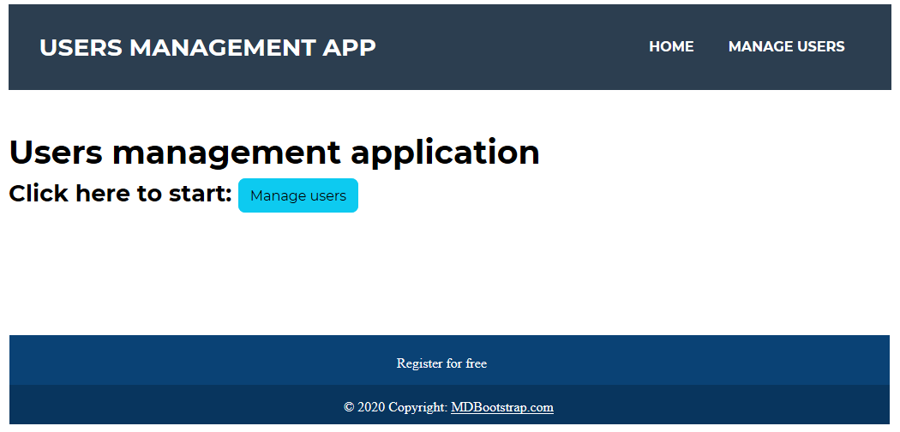
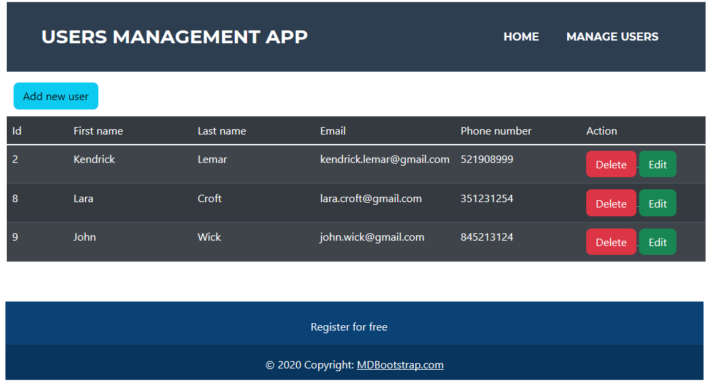
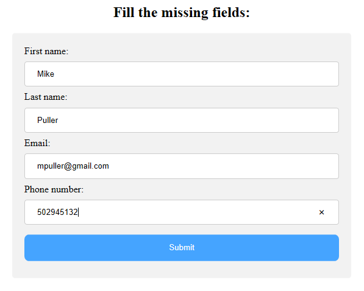
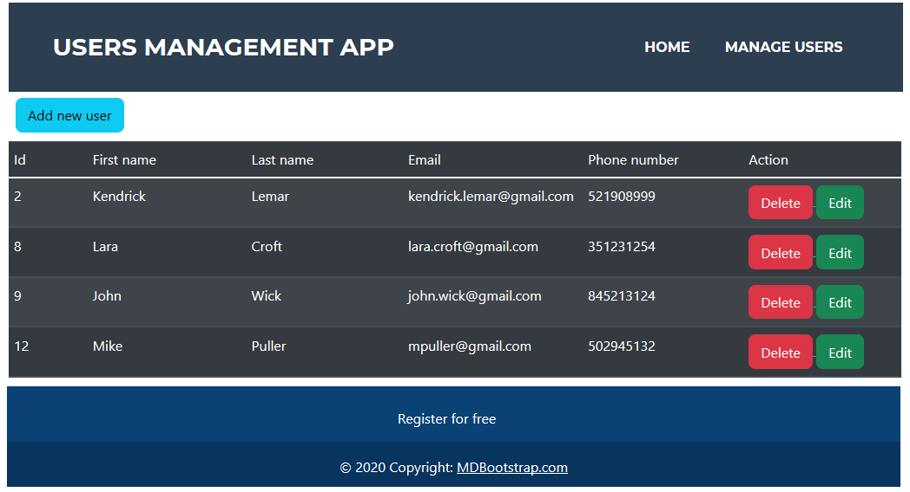

# JavaUserManagementWebApp

This is one of my first projects in Java. 
I did this simple project because I got interested in programming web applications in Java.  
It is an application that is used to manage users in a database.
It allows viewing existing users, adding new users, editing and deleting. 
This project has only one commit, when I uploaded it to the repository, because I did not know GIT when I started programming this app.
This project also contains some unit tests.

## Used technologies
- Maven,
- Bootstrap,
- JSTL,
- JUnit,
- Hibernate,
- MySQL database.

# How it works ?

After launching the application in your browser, a home page will appear at the corresponding address.

After pressing the Manage users button, a table of users will appear.

Press the Add new user button to add a new user. 
A form for adding a user will appear, which must be filled. 

Click Submit button to add new user.

You can also edit and delete selected users by clicking the appropriate button.
The same form is used to edit the user to make changes.

# Author
Michal Wonia  
Poland
